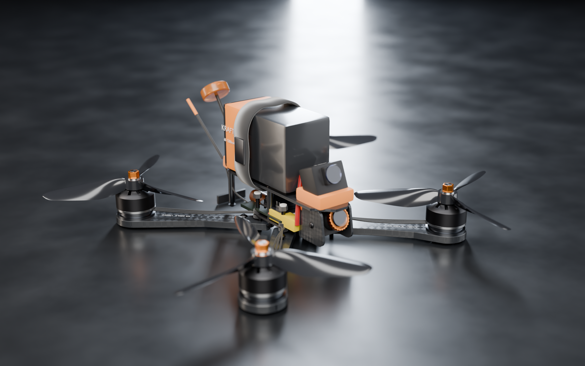

# KR-5 "APEX" — 5-inch Freestyle FPV Quadcopter (Parametric 3D Design)

En komplett, fotorealistisk 3D-konstruktion av en 5-tums freestyle-FPV-drönare,
byggd helt i kod med **Blender** (professionell 3D-mjukvara, samma verktyg som
används inom film/VFX och produktvisualisering). Varje komponent är modellerad
i **verklig skala (millimeter)** och hela luftfartyget genereras parametriskt
från en måttabell — ändra ett värde (t.ex. hjulbas eller propellerdiameter)
och hela modellen byggs om.



## Innehåll

| Fil | Beskrivning |
|---|---|
| `generate_drone.py` | Parametriskt byggskript (Blender 4.x/5.x, `pip install bpy`) |
| `out/kr5_apex.blend` | Komplett Blender-scen (modell + studio + kameror + ljus) |
| `out/kr5_apex.glb` | glTF-export i verklig skala — öppna i valfri 3D-viewer/AR |
| `out/*_full.png` | Fotorealistiska Cycles-renderingar (path tracing + denoise) |
| `viewer.html` | Interaktiv 3D-visare i webbläsaren (three.js, snurra/zooma) |

## Kör själv

```bash
pip install bpy                      # Blender som Python-modul
python3 generate_drone.py            # snabb förhandsvisning
FULL=1 python3 generate_drone.py     # slutrenderingar + .blend + .glb
SHOTS=hero,motor python3 generate_drone.py   # rendera valda vyer
```

## Specifikation (som modellerad)

| Parameter | Värde |
|---|---|
| Klass | 5" freestyle, true-X |
| Hjulbas (motor–motor diagonal) | **224,9 mm** |
| Armar | 5 mm kolfiber, utbytbara, klämda mellan två 2 mm-plattor |
| Plattor | 2 mm kolfiber-twill (procedurellt 2×2-vävmaterial med anisotropisk spekular + klarlack) |
| Motorer | 4 × **2306.5 / 1750 KV** — svarvad klocka med kylslitsar, 12 synliga kopparlindningar, magnetring, 16×16 mm M3-fäste |
| Propellrar | 4 × **5,1 × 4,9 tri-blade**, parametriskt genererade: NACA-profilsektion, geometrisk pitch-twist θ(r) = atan(P/2πr), tip-sweep, avrundad spets. CW/CCW-par enligt Betaflight-standard |
| ESC | 60 A 4-i-1, 30,5 × 30,5 mm, 8 FET:ar, lödda motorfaser (3 per hörn) |
| FC | F7, USB-C, 4 × JST-portar, gyro, statuslysdioder, vibrationsdämpad på TPU-gummin |
| VTX | Digital enhet med flänsad aluminiumkylare |
| FPV-kamera | 19 mm micro, 25° tilt, glaslins med blå AR-coating, orange fokusring med knurl |
| HD-kamera | "Naked" actionkamera i TPU-vagga på nosen, 22° tilt |
| Batteri | **6S 1300 mAh 120C** LiPo (75 × 39 × 48 mm), krympplastfinish, tryckta etiketter, balanskabel |
| Ström | XT60-par (hane+hona, ihopkopplade), 12 AWG-kablar med naturligt kabelhäng, 1000 µF 35 V low-ESR-kondensator på TPU-sadel |
| Antenner | RHCP "lollipop" VTX-antenn (klöverblad i koppar synligt i radomen) på TPU-fäste, 38° bakåtvinkel + ELRS 2,4 GHz-dipol |
| Hårdvara | M3 kullerförsänkta insexskruvar (korrekta proportioner, riktig insexficka), nylonlåsmuttrar, 25 mm-standoffs i gunmetal-anodiserad aluminium |
| Övrigt | Batteristrap (vävd rem + metallspänne), halkskyddsmatta, bakre LED-list, motorspecar tryckta på armarna |

## Teknik

- **Allt är kod.** Ingen manuell modellering — `bmesh`-byggda solider, svarvade
  (lathe/spin) motorprofiler, boolean-utskurna CNC-plattor med fasade kanter,
  Bezier-kablage med `bevel_object`-svept batteristrap.
- **Propellerbladen** genereras som ett parametriskt ytnät: NACA 4-digit
  tjocklek + välvning, kordfördelning, geometrisk pitch per radie och
  spegelvänd geometri för CW/CCW.
- **Material:** Principled BSDF (PBR) — procedurell kolfiberväv, anodiserad
  aluminium, emaljerad koppartråd, halvtransparent polykarbonat (propellrar),
  TPU med synliga 3D-printlager, PCB-lödmask, glaslinser med transmission.
- **Rendering:** Cycles path tracing, CPU, adaptiv sampling + OpenImageDenoise,
  AgX-färghantering, studiosättning med softbox/rim/fill-arealjus och
  skärpedjup per kamera.
- **Export:** glTF (GLB) i verklig skala — modellen är 1:1 i meter, så den
  visas i korrekt storlek i AR-visare.

## Renderade vyer

| Vy | Fil |
|---|---|
| Hjältebild ¾ | `out/hero_full.png` |
| Front (FPV-kamera) | `out/front_full.png` |
| Ovanifrån (layout) | `out/top_full.png` |
| Motormakro | `out/motor_full.png` |
| Bakparti (antenn/stack) | `out/rear_full.png` |
| Sidoprofil | `out/side_full.png` |
